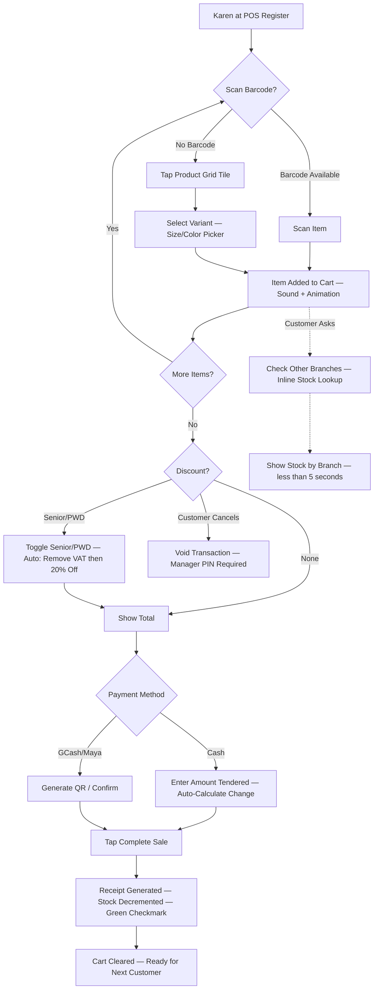
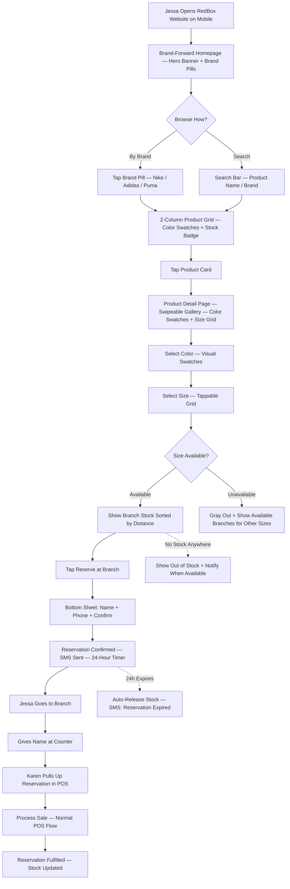
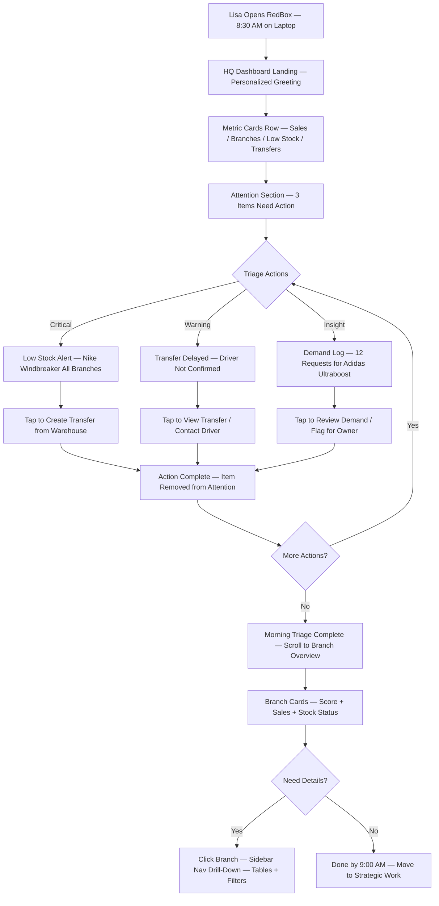
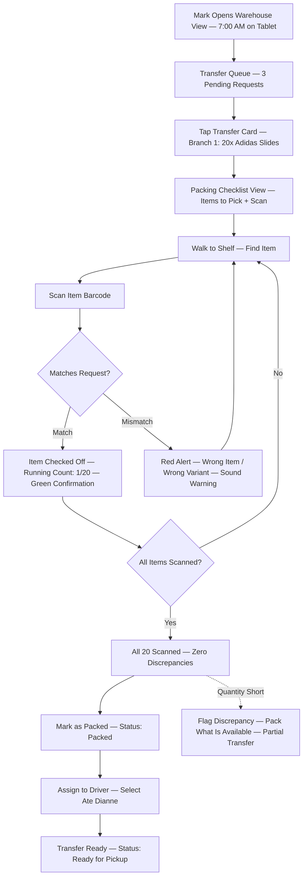
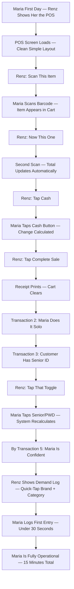

# UX Design Specification: RedBox Apparel

**Author:** FashionMaster
**Date:** 2026-02-26

---

<!-- UX design content will be appended sequentially through collaborative workflow steps -->

## Executive Summary

### Project Vision

RedBox Apparel is a unified commerce platform for Philippine multi-branch branded apparel retail, serving **8 distinct user personas** across **6 different interface types**. The UX challenge is fundamentally a multi-experience design problem: each interface must be optimized for its specific context (POS speed, HQ data density, customer browsing, warehouse scanning, driver mobility) while sharing a coherent visual language and design system.

The platform replaces fragmented Excel/Viber workflows with real-time, role-tailored interfaces that make every user's daily work faster and more informed. The UX must embody the principle: **the right information, for the right person, at the right moment, on the right device.**

### Target Users

| User | Interface | Device | Context | Key UX Need |
|---|---|---|---|---|
| **Ate Lisa (HQ Staff)** | Data-dense dashboard | Desktop | Office, analytical work | See all branches at a glance; drill-down into details |
| **Kuya Renz (Branch Manager)** | Branch command center | Tablet/Desktop | On the floor, between customers | Quick daily overview; one-tap actions |
| **Ate Karen (Cashier)** | POS Terminal | Dedicated tablet | Standing, fast-paced, queued customers | Speed above all; <3s transactions; large touch targets |
| **Kuya Mark (Warehouse)** | Warehouse scanner UI | Tablet | Standing, moving, scanning items | Scan-centric; minimal typing; clear status feedback |
| **Ate Dianne (Driver)** | Mobile delivery view | Smartphone, one-hand | In transit, Manila traffic | Card-based delivery list; one-tap status; GPS |
| **Jessa (Customer)** | Public website | Mobile (primary) | Browsing during commute/lunch | Fast load; brand browsing; check stock; reserve |
| **Mang Tony (Supplier)** | Supplier portal | Desktop | Office, business context | Demand signals; PO management |
| **Boss Arnel (Owner)** | CEO dashboard + Admin | iPad/Desktop | Home, weekends, strategic review | One-glance business health; drill-down; admin tasks |

**User Tier Priority:**
- **Tier 1 (Core Operations):** HQ Staff, Branch Manager, Cashier — generate the data everything depends on
- **Tier 2 (Fulfillment):** Warehouse Staff, Driver — move stock based on Tier 1 data
- **Tier 3 (External-Facing):** Customer, Supplier — consume and contribute through external interfaces
- **Tier 4 (Strategic):** Owner/Admin — insights and decisions powered by all other tiers

### Key Design Challenges

1. **Multi-interface coherence** — 6+ distinct UIs must share a visual language (shadcn/ui + Tailwind) while being optimized for wildly different use cases. POS needs speed and large touch targets; HQ needs data density and charts; customer website needs premium brand browsing with SEO.

2. **Offline POS seamlessness** — The cashier cannot know or care if they're online or offline. No error modals, no "waiting for sync" spinners. Connection status must be ambient (a small indicator), never blocking. The transaction flow must feel identical regardless of connectivity.

3. **Philippine retail realities** — Noisy stores, glare on tablet screens, varying tech comfort among cashiers (Journey 9: new cashier Maria productive in <15 minutes), customers in a hurry. The POS is essentially an industrial interface — optimized for speed and error-resistance under pressure.

4. **Brand-first product discovery** — The customer website must make branded apparel browsing feel premium while showing real-time stock data per branch without feeling like a spreadsheet. The challenge: data-heavy information presented with consumer-grade polish.

5. **9 route groups, 1 codebase** — Auth, POS, HQ, Branch, Warehouse, Customer, Admin, Driver, Supplier interfaces all live in a single Next.js app. Each needs distinct layout, navigation, and interaction patterns while sharing core components.

### Design Opportunities

1. **Role-tailored "morning command centers"** — Each user gets a personalized landing screen showing exactly what they need: Renz sees branch health, Lisa sees all-branch overview, Karen sees her shift status and queue. First impressions that say "this was built for YOU."

2. **The Check-Reserve-Pickup loop** — The customer website's unique "reverse commerce" model is a UX differentiator. Making this 3-tap flow (find product → check branch stock → reserve for pickup) buttery smooth could define the brand experience and drive repeat usage.

3. **Ambient intelligence** — Low-stock alerts, demand insights, branch scores, and AI suggestions can be surfaced as gentle contextual nudges rather than dashboard charts people ignore. "Your Medium windbreakers will sell out by Saturday" appears at the moment it's actionable.

4. **30-second demand logging** — If the cashier demand log is frictionless enough (quick-tap brand + category + size), it creates a data moat no competitor has: what customers WANT but can't buy. The UX design of this micro-interaction directly determines whether the feature gets used.

5. **Progressive complexity** — New cashier Maria is productive in 15 minutes (Journey 9), while experienced users like Ate Lisa access advanced analytics and AI insights. The interface grows with the user.

## Core User Experience

### Defining Experience

RedBox has **multiple core loops** across its 8 personas, but a clear hierarchy emerges:

**Primary Core Action: The POS Transaction**
The most frequent interaction — hundreds of times per day per branch. Scan → total → pay → receipt in <3 seconds. This is the heartbeat of the business. If the POS feels slow or clunky, the entire platform loses credibility.

**Universal Core Action: The Stock Check**
"Do we have this?" is the ONE question the entire system answers. It crosses every persona:
- Karen checks from the POS register
- Renz checks other branches from the branch dashboard
- Jessa checks from the customer website on her phone
- Lisa checks across all branches from HQ
- Mark checks warehouse inventory while packing

Every interface must answer this question instantly in its own context-appropriate way.

**Daily Core Action: The Morning Command Center**
The first 30 seconds after opening the app each morning. If this moment doesn't deliver instant clarity, trust erodes. Every role-specific landing page must answer: **"What do I need to know right now?"**

### Platform Strategy

**Single Codebase, Multiple Experiences:**
- **Web-based, all interfaces** — Next.js 15 App Router serves all 9 route groups. No native apps.
- **Touch-first** for POS, Warehouse, and Driver — standing, moving, scanning users
- **Mouse/keyboard-first** for HQ, Admin, and Owner — data-dense, analytical work
- **Mobile-first** for Customer website and Driver — phone is the primary device
- **Offline-capable** for POS — Service Worker + IndexedDB with seamless sync
- **PWA-installable** for POS — fullscreen tablet operation via manifest.json

**Device-Interface Mapping:**

| Interface | Primary Device | Input Mode | Orientation |
|---|---|---|---|
| POS Terminal | Tablet (10"+) | Touch | Landscape |
| HQ Dashboard | Desktop/Laptop | Mouse + Keyboard | Landscape |
| Branch Dashboard | Tablet/Desktop | Touch + Mouse | Both |
| Warehouse | Tablet (10"+) | Touch + Scanner | Portrait |
| Driver View | Smartphone | Touch (one-hand) | Portrait |
| Customer Website | Smartphone (primary) | Touch | Portrait (mobile), Landscape (desktop) |
| Owner Dashboard | iPad/Desktop | Touch + Mouse | Landscape |
| Supplier Portal | Desktop | Mouse + Keyboard | Landscape |
| Admin Panel | Desktop | Mouse + Keyboard | Landscape |

### Effortless Interactions

These interactions must feel like zero effort — they define whether users adopt or abandon the system:

1. **Senior/PWD Discount** — One tap. Auto VAT exemption, auto BIR receipt formatting. Karen never touches a calculator. The system handles the correct computation (remove VAT first, then 20% off base price) invisibly.

2. **Cross-Branch Stock Lookup** — Customer asks "Do you have this in blue?" Karen answers in 5 seconds from her POS register. No navigating away from the transaction screen. No calling other branches.

3. **Demand Logging** — <30 seconds end-to-end. Quick-tap brand selector → category → size/notes → submit. If it takes longer, cashiers won't bother. The UX of this micro-interaction determines whether the feature delivers its data moat.

4. **Reserve for Pickup** — 3 taps on mobile: find product → see branch stock → reserve. No account creation required (name + phone only). Confirmation with 24-hour pickup window.

5. **Transfer Status** — Glance at a status pill (Requested → Packed → In Transit → Delivered). No clicking into details unless you want them. Color-coded. Obvious at arm's length on a warehouse tablet.

6. **Offline-to-Online Transition** — Invisible. Karen never sees a modal, a spinner, or an error. A small ambient indicator (green dot / amber dot) is the only hint. Transactions flow identically in both states.

7. **End-of-Day Drawer Balance** — 2 minutes max. System shows expected total, cashier enters physical count, difference calculated automatically. No spreadsheets.

### Critical Success Moments

These moments determine whether each user trusts and adopts the system:

| Moment | User | Why It's Make-or-Break |
|---|---|---|
| **First Senior/PWD discount processed correctly** | Ate Karen | If the math is wrong or slow, trust dies on Day 1 |
| **Morning dashboard loads instantly with fresh data** | Kuya Renz, Ate Lisa | If stale or slow, they go back to Excel |
| **Customer checks stock online, arrives, item IS there** | Jessa | This IS the product promise. One failure = lost customer |
| **New cashier Maria's first solo transaction** | New Employee | If she can't complete a sale after 15 min training, the POS failed |
| **Lisa sees a problem before anyone calls** | Ate Lisa | The "aha moment" — the system sees what Excel couldn't |
| **Offline transaction syncs seamlessly on reconnect** | Ate Karen | If she notices a glitch, she'll distrust offline mode permanently |
| **Scan-to-receive matches the PO exactly** | Kuya Mark | Warehouse trust in the system hinges on this first accurate receive |
| **Branch score reflects reality** | Boss Arnel | If scoring doesn't match his intuition, he won't trust AI insights |

### Experience Principles

Five guiding principles for all UX decisions across RedBox:

**1. Speed Is the Feature**
Every interaction optimized for minimum taps/clicks. POS transactions <3 seconds. Dashboard loads <2 seconds. Stock checks <500ms. Speed isn't a non-functional requirement — it IS the user experience. If it's not fast, it's not done.

**2. Role-First, Not Feature-First**
Users don't navigate "modules" or "features." They land on THEIR command center with THEIR data. The interface knows who you are and shows what you need. A cashier never sees inventory management menus. A driver never sees financial reports. Every pixel serves the current user's role.

**3. Invisible Complexity**
VAT calculations, sync engines, branch isolation, conflict resolution, real-time subscriptions — all happening silently beneath a simple surface. The user never sees the plumbing. Online and offline feel identical. Multi-branch data isolation is invisible. The system does the hard work so the user doesn't have to think about it.

**4. Trust Through Accuracy**
If the system says "3 in stock at SM North," there MUST be 3 in stock at SM North. Every UX decision must reinforce data trustworthiness. Real-time indicators ("Updated 2 seconds ago"), accurate counts, immediate sync — trust is built interaction by interaction and destroyed by a single wrong number.

**5. Graceful Escalation**
Simple by default, powerful on demand. New cashier Maria sees big buttons and clear flow. Experienced Ate Lisa accesses cross-branch analytics and AI insights. Same system, different depth. No user is overwhelmed. No user is limited. The interface reveals complexity only when the user asks for it.

## Desired Emotional Response

### Primary Emotional Goals

**Core Emotion: Confidence Through Clarity**
Every user should feel like they know exactly what's happening — no guessing, no chasing, no uncertainty. The system replaces anxiety with information and hesitation with decisive action.

**Per-Persona Emotional Transformation:**

| User | Current Emotion (Without RedBox) | Desired Emotion (With RedBox) |
|---|---|---|
| **Ate Lisa (HQ)** | Stressed, drowning in Excel, reactive | **In control.** Calm command. "I see everything." |
| **Kuya Renz (Branch)** | Anxious about stockouts, blind to other branches | **Confident.** "I know exactly where my branch stands." |
| **Ate Karen (Cashier)** | Nervous about discount math, can't answer questions | **Competent.** "I can handle anything at the register." |
| **Kuya Mark (Warehouse)** | Overwhelmed by sticky notes, counting errors | **Precise.** "Every scan matches. Zero guesswork." |
| **Ate Dianne (Driver)** | Frustrated by unclear routes, wasted trips | **Efficient.** "Every delivery goes smoothly." |
| **Jessa (Customer)** | Annoyed by wasted trips, size not available | **Relieved.** "It said it was there, and it WAS there." |
| **Mang Tony (Supplier)** | Guessing what clients need, cold-calling | **Informed.** "I know what they need before they ask." |
| **Boss Arnel (Owner)** | Dependent on staff for info, delayed decisions | **Empowered.** "I see my business clearly, anytime." |

### Emotional Journey Mapping

**First Encounter → Adoption → Mastery:**

| Stage | Emotion | UX Implication |
|---|---|---|
| **First Login** | Curious but cautious — "Is this really better than Excel?" | Clean, uncluttered landing. Immediate value visible (real-time data they couldn't get before). No tutorials — the interface IS the tutorial. |
| **First Core Action** | Nervous anticipation — "Will this work?" | Instant feedback. Green confirmation. Correct numbers. The first Senior/PWD discount that calculates perfectly. The first dashboard that loads instantly. |
| **First Week** | Growing trust — "This actually saves me time" | Consistency builds confidence. Every day the data is accurate. Every transaction is smooth. The system earns trust through repetition. |
| **First Month** | Reliance — "I can't go back to Excel" | The system becomes indispensable. Lisa finishes her morning review by 9 AM instead of noon. Karen doesn't think about discount formulas anymore. |
| **Ongoing** | Ownership — "This is MY tool" | Users feel the system was built for them specifically. They know their shortcuts. They trust the data. They'd resist going back. |

**Error Moments (When Things Go Wrong):**

| Error Type | Desired Emotion | UX Approach |
|---|---|---|
| Internet goes down mid-transaction | Calm — "It's fine, I can keep going" | Seamless offline mode; ambient status indicator only |
| Stock count mismatch | Informed — "I can see and flag this" | Clear discrepancy UI; one-tap flag for HQ review |
| Transfer item damaged | Efficient — "I can report this quickly" | Partial delivery handling with photo + reason in <30 seconds |
| Customer reservation expired | Neutral — "System handled it" | Auto-notification to customer; expired reservation auto-released |

### Micro-Emotions

**Critical micro-emotions that drive adoption:**

- **Confidence over confusion** — POS buttons are obvious, math is automatic, receipts are correct. No hesitation at the register.
- **Trust over skepticism** — "Is this stock count real?" must NEVER be a question. Accuracy breeds trust, inaccuracy destroys it permanently.
- **Accomplishment over frustration** — End of shift: "87 transactions, zero errors." End of day for Lisa: "Done by 9 AM." The feeling of finishing fast.
- **Relief over anxiety** — Jessa arrives and her size IS there. Karen's Senior discount is correct. The internet drops and the POS keeps working.
- **Precision over chaos** — Mark scans 50 items and every one matches the PO. No sticky notes. No tally sheets. No miscounts.

**Emotions to actively prevent:**

- **Embarrassment** — Karen computing a Senior discount wrong in front of a waiting customer
- **Helplessness** — "The internet is down, I can't sell anything"
- **Distrust** — "The system says 5 in stock but I only count 3"
- **Overwhelm** — Maria on Day 1 staring at a screen full of unfamiliar buttons
- **Abandonment** — Boss Arnel asking a question the system can't answer, forcing him back to calling staff

### Design Implications

**Emotion-to-Design Translation:**

| Desired Emotion | UX Design Approach |
|---|---|
| **Confidence** | Large touch targets (min 44px); instant visual feedback on every tap; auto-calculations with clear breakdowns; confirmation states that say "you did it right" |
| **Trust** | Real-time "updated X seconds ago" timestamps on stock data; sync status indicators; consistent accuracy across all interfaces; audit trail visibility |
| **Speed/Efficiency** | Minimal taps to complete any action; smart defaults (most common payment method pre-selected); barcode-first input; skip unnecessary confirmation dialogs |
| **Relief** | Seamless offline mode with no user action needed; auto-save everything; undo capability for mistakes; gentle "success" feedback (checkmark, subtle animation) |
| **Control** | Role-filtered views showing only relevant data; drill-down on demand; clear data hierarchy; nothing hidden — every number is explainable |
| **Precision** | Scan-to-verify workflows; running counts during packing; mismatch highlights in red; zero ambiguity in quantities |
| **Delight** | Morning dashboard pre-loaded with actionable insights; stock check answered in 2 seconds; perfectly formatted BIR receipt in one tap; AI suggestion that's actually useful |

### Emotional Design Principles

**1. Earn Trust in the First 5 Minutes**
The first interaction with each interface must deliver a moment of "this is better." For Karen: a perfectly computed Senior discount. For Lisa: all branches visible at once. For Jessa: real-time stock that's actually accurate. Trust is earned in moments and lost in moments.

**2. Prevent Negative Emotions, Don't Just Create Positive Ones**
Eliminating embarrassment, helplessness, and distrust is more important than adding delight. A cashier who never feels embarrassed by a wrong calculation will trust the system far more than one who occasionally gets a nice animation.

**3. Make Success Feel Effortless**
Accomplishment should feel like "of course it worked" rather than "wow, that actually worked." The system should make competence feel natural — Karen processes 87 transactions without thinking about it. That's the feeling.

**4. Status, Not Surprises**
Users want to feel informed, not startled. Alerts are ambient and contextual, not modal and blocking. The morning dashboard says "3 items need attention" — not a red banner screaming "URGENT." Calm confidence, not alarm fatigue.

**5. Respect the User's Context**
Karen is standing with customers waiting. Mark is walking between shelves with a tablet in one hand. Dianne is driving. Arnel is on his couch on Sunday. Every emotional design decision must consider the physical and mental context of the user at that moment.

## UX Pattern Analysis & Inspiration

### Inspiring Products Analysis

**Grab (Southeast Asia Super-App) — Workflow & Delivery UX**

Grab is the most relevant UX reference because RedBox's Philippine users already have Grab's interaction patterns as muscle memory. Key UX successes:

- **Status Progression:** Visual flow through clear states (Booking → Driver Found → On the Way → Arrived) with color-coded status pills. Zero ambiguity about "where things are." Maps directly to RedBox's transfer workflow and delivery tracking.
- **One-Tap Actions:** Drivers update status with a single button tap — no forms, no typing, no friction. Designed for one-handed mobile use in traffic. Maps to Dianne's driver view and Mark's packing confirmations.
- **Real-Time Tracking:** Live map with continuous ETA updates. Users trust the system because they can SEE movement happening. Maps to Lisa's transfer tracking and customer delivery tracking.
- **Card-Based Task Lists:** Deliveries displayed as stacked cards with key info (address, items, status) visible at a glance. Tap to expand, swipe to act. Maps to warehouse packing queues, driver manifests, and reservation lists.
- **Ambient Notifications:** Gentle, informative push notifications ("Your driver is 2 min away") that are contextual rather than alarming. Maps to RedBox's low-stock alerts and transfer status updates.
- **Philippine Internet Resilience:** Grab handles spotty connectivity gracefully — retries silently, caches states, never crashes. The exact model for RedBox's offline POS behavior.

**Square POS (Global POS Standard) — Transaction Speed UX**

Square sets the benchmark for POS interface design:

- **Grid-Based Item Layout:** Products displayed as large, tappable tiles for speed. No scrolling through lists — visual recognition is faster than reading.
- **Transaction-Centric Screen:** The sale IS the screen. Minimal navigation, no menus to dig through. Cart on one side, actions on the other.
- **Visual Split Payments:** Payment splitting handled with clear visual metaphors, not form fields.
- **One-Screen Reconciliation:** End-of-day cash balance done on a single screen with expected vs. actual and auto-calculated difference.

**Shopee (Philippine E-Commerce) — Mobile Commerce UX**

Shopee represents how Philippine consumers already browse and shop digitally:

- **Brand-First Navigation:** Users can browse by brand, which maps to RedBox's Brand → Category → Style → Variant hierarchy.
- **Seller/Branch Availability:** Product pages show which sellers have stock — analogous to RedBox showing which branches have Jessa's size.
- **Mobile-First Product Cards:** Price, availability, and key info visible without tapping into the product. Quick decision-making.
- **Minimal Friction Checkout:** Philippine users expect fast checkout with GCash/Maya integration — no multi-step forms.

**Nike App (Product Display Gold Standard) — Branded Apparel UX**

Since RedBox sells Nike, Adidas, and similar brands, Nike's own product display sets the standard:

- **Hero Product Imagery:** Large, lifestyle photography dominates the page — products look aspirational, not clinical. The product IS the experience.
- **Bold Typography:** Product name and price scannable in <1 second. No visual clutter competing with the product.
- **Visual Color Swatches:** Color selection via circles/dots, not dropdowns. Instant variant recognition without extra taps.
- **Clean Size Grid:** Available sizes bold and tappable, unavailable sizes grayed out. Availability is immediately obvious.
- **"Available at" Location Pattern:** Shows store availability — directly maps to RedBox's branch stock display.

**ZARA App (Editorial Minimalism) — Premium Feel UX**

Full-bleed product photography with minimal UI chrome:

- **Product-as-Interface:** The image IS the page. Swipe through 3-5 product images naturally.
- **Inline Size Availability:** Sizes shown on the product page with clear available/unavailable states.
- **Lesson Learned:** ZARA's "+" button for sizes confused users — RedBox must use unambiguous size selectors.

**Uniqlo (Functional Clarity) — Catalog Browsing UX**

Clean, consistent product display that builds trust:

- **Consistent Photography Style:** Uniform product images across the catalog — builds professional brand trust.
- **Color Swatches on Grid Cards:** See available colors without tapping into detail — reduces unnecessary navigation.
- **Multiple Thumbnails:** Research confirms 2 images is insufficient for apparel — 3-5 images per product minimum.
- **Clear Filtering:** Brand, category, size, color filters with immediate results.

**Zalora (PH Market Reference) — Local Commerce UX**

Philippine users already know this browsing pattern:

- **Brand-Logo Navigation Bar:** Brand-first browsing that Philippine shoppers expect.
- **Price + Discount Prominence:** Price and sale information visible on product cards.
- **"Low Stock" Badges:** Urgency indicators on cards driving purchase decisions.
- **Mobile Grid:** 2-column, thumb-friendly scroll optimized for mobile browsing.

### Transferable UX Patterns

**Navigation Patterns:**

| Pattern | Source | RedBox Application |
|---|---|---|
| Status pill progression | Grab | Transfer workflow (Requested → Packed → In Transit → Delivered); delivery tracking |
| Card-based task queue | Grab | Warehouse packing queue; driver delivery manifest; reservation list |
| Grid-based item selection | Square POS | POS product grid for manual item lookup (when barcode unavailable) |
| Brand-first browsing | Shopee/Zalora/Nike | Customer website brand navigation: /brands/nike → products → variants |
| Tab-based dashboard sections | Common | HQ and Branch dashboards: Overview / Stock / Sales / Alerts as tabs |

**Interaction Patterns:**

| Pattern | Source | RedBox Application |
|---|---|---|
| One-tap status update | Grab | Driver delivery confirmation; warehouse pack confirmation; transfer receipt |
| Scan-then-confirm | Square | POS barcode scan → item in cart; warehouse scan → item checked off |
| Swipe to act on cards | Grab | Swipe delivery card to complete; swipe transfer to start packing |
| Pull-to-refresh | Universal mobile | Dashboard data refresh; stock level refresh on branch view |
| Bottom sheet for details | Grab/Shopee | Tap a product → bottom sheet with variant details and branch stock |
| Visual color swatches | Nike/Uniqlo | Product cards and detail pages: color dots instead of text dropdowns |
| Swipe image gallery | Nike/ZARA | Product detail page: 3-5 lifestyle + detail shots, swipeable |

**Visual Patterns:**

| Pattern | Source | RedBox Application |
|---|---|---|
| Color-coded status | Grab | Green (complete), Blue (active), Yellow (pending), Red (alert) |
| Large touch targets | Square POS | All POS buttons min 44px; payment method buttons prominent |
| Ambient status bar | Grab | Connection: green dot (online) / amber dot (offline) — never modal |
| Real-time freshness | Grab | "Stock updated 3s ago" timestamps on inventory displays |
| Hero product imagery | Nike | Customer website product pages: large lifestyle photography |
| Inline size availability | ZARA/Nike | Bold = available, gray = unavailable; branch-specific display |
| 2-column mobile grid | Zalora/Shopee | Customer website product listing: thumb-friendly browse |

### Anti-Patterns to Avoid

| Anti-Pattern | Why It's Bad | RedBox Risk Area |
|---|---|---|
| **Confirmation dialogs for routine actions** | Slows POS transactions; breaks flow | POS: never ask "Are you sure?" for adding items or payment |
| **Modal error popups** | Block the user; create panic | Offline mode: never show "Connection lost" modal |
| **Nested navigation >2 levels** | Users get lost | HQ dashboard: flat structure with tabs, not nested menus |
| **Tiny tap targets on touch** | Mis-taps cause errors | POS + Warehouse: everything tappable 44px+ |
| **Loading spinners without context** | No idea if 2 seconds or 2 minutes | Use skeleton screens; indicate what's loading |
| **Form-heavy data entry** | Cashiers won't type | Demand logging: quick-tap selectors, not text fields |
| **Alert fatigue** | Users ignore all alerts | Limit to actionable items; batch low-priority |
| **Feature-module navigation** | Nobody thinks in "modules" | Role-first: users land on their view, not a module picker |
| **Tiny product images** | Can't evaluate apparel from thumbnails | Customer website: large hero images, 3-5 per product |
| **Dropdown menus for size/color** | Too slow for mobile | Visual selectors: color dots, size grid |
| **Stock info hidden behind taps** | RedBox's differentiator IS upfront stock | Show branch availability on product cards |
| **Generic product photography** | Branded apparel needs lifestyle context | Use lifestyle + detail + on-model shots |

### Design Inspiration Strategy

**What to Adopt Directly:**
- Grab's **status pill progression** for all workflow states (transfers, deliveries, reservations)
- Grab's **card-based task queue** for warehouse, driver, and reservation interfaces
- Square's **transaction-centric POS layout** — cart + actions, nothing else
- Nike's **hero product imagery** and **visual color swatches** for customer website
- Zalora/Shopee's **brand-first browsing** pattern for customer website navigation
- Nike/ZARA's **inline size availability** showing branch-specific stock

**What to Adapt:**
- Grab's **real-time tracking** → simplified for transfer tracking (status pills, no live GPS map)
- Square's **grid-based item selection** → secondary to barcode scanning in POS
- Shopee's **product cards** → adapted to show branch-level stock instead of seller availability
- Nike's **product detail page** → add branch stock display and reserve-for-pickup CTA
- Uniqlo's **consistent photography** → uniform product images across RedBox catalog

**What to Avoid:**
- Shopee's **information overload** on product pages — RedBox customer site must be cleaner
- ZARA's **ambiguous iconography** (confusing "+" for sizes) — use clear, labeled selectors
- Generic POS's **module-based navigation** — RedBox is role-first, not feature-first
- Dashboard tools' **chart-heavy landing pages** — lead with actionable items, not pretty graphs
- Any **dropdown-based variant selection** — always use visual swatches and grids

## Design System Foundation

### Design System Choice

**Themeable System: shadcn/ui + Tailwind CSS with Interface-Specific Themes**

The architecture already specifies shadcn/ui + Tailwind CSS as the component foundation. Rather than a single global theme, RedBox uses a **multi-theme approach** — shared core design tokens with interface-specific variant layers that optimize each route group for its unique context.

### Rationale for Selection

| Factor | Why shadcn/ui + Tailwind |
|---|---|
| **Already decided in architecture** | Next.js 15 + Tailwind + shadcn/ui is the confirmed stack — no switching cost |
| **Copy-paste ownership** | shadcn/ui components are copied into `src/components/ui/`, giving full control to customize per interface |
| **Tailwind variant system** | CSS utility classes + variants make interface-specific theming straightforward without CSS-in-JS overhead |
| **Accessibility built-in** | shadcn/ui uses Radix primitives with ARIA compliance out of the box |
| **Performance** | Tailwind purges unused CSS; shadcn/ui components are tree-shakeable; no runtime CSS cost |
| **Speed + Uniqueness balance** | Proven components for speed, full customization for brand uniqueness |
| **Community + Docs** | Extensive shadcn/ui ecosystem with growing component library |

### Implementation Approach

**Multi-Theme Architecture:**

```
src/
├── components/ui/          ← shadcn/ui base components (shared)
├── styles/
│   ├── tokens.css          ← Core design tokens (colors, spacing, radii)
│   ├── theme-pos.css       ← POS overrides (large targets, high contrast)
│   ├── theme-dashboard.css ← HQ/Branch overrides (data-dense, compact)
│   ├── theme-customer.css  ← Customer overrides (premium, brand-forward)
│   ├── theme-warehouse.css ← Warehouse overrides (scan-centric, bold status)
│   └── theme-mobile.css    ← Driver overrides (one-hand, card-based)
├── app/
│   ├── (pos)/layout.tsx    ← Applies theme-pos
│   ├── (hq)/layout.tsx     ← Applies theme-dashboard
│   ├── (customer)/layout.tsx ← Applies theme-customer
│   └── ...
```

Each route group's `layout.tsx` applies a CSS class (e.g., `theme-pos`) that activates interface-specific token overrides via CSS custom properties. Components remain shared; only the tokens change per context.

### Customization Strategy

**Brand Color Tokens:**

| Token | Value | Usage |
|---|---|---|
| `--brand-primary` | RedBox Red (#DC2626) | Primary actions, brand identity, headers |
| `--brand-secondary` | Charcoal (#1F2937) | Text, secondary UI elements |
| `--status-success` | Green (#16A34A) | Completed, confirmed, in-stock |
| `--status-warning` | Amber (#F59E0B) | Pending, low stock, attention needed |
| `--status-danger` | Red (#EF4444) | Errors, out-of-stock, critical alerts |
| `--status-info` | Blue (#3B82F6) | Informational, in-transit, active |

**Typography Scale Per Interface:**

| Interface | Base Size | Scale | Font |
|---|---|---|---|
| **POS** | 18px | 1.25 (Major Third) | Inter — high legibility at arm's length |
| **HQ/Branch Dashboard** | 14px | 1.2 (Minor Third) | Inter — data density without eye strain |
| **Customer Website** | 16px | 1.333 (Perfect Fourth) | Inter + display font for brand headlines |
| **Warehouse** | 16px | 1.25 (Major Third) | Inter — bold weights for scan confirmation |
| **Driver Mobile** | 16px | 1.2 (Minor Third) | Inter — system-like clarity |

**Interface-Specific Component Variants:**

| Component | POS Variant | Dashboard Variant | Customer Variant |
|---|---|---|---|
| **Button** | 56px height, bold, full-width | 36px height, compact | 44px height, rounded, brand-colored |
| **Card** | High contrast, large text | Compact, data-dense, hover states | Elevated, image-forward, lifestyle feel |
| **Table** | Not used (grid/cards only) | Sortable, filterable, compact rows | Not used (product grids only) |
| **Input** | Large, touch-friendly, 48px+ | Standard 36px, keyboard-optimized | 44px, rounded, clean |
| **Status Badge** | XL pills, color-coded, readable at distance | Small badges, inline | Subtle tags, brand-aligned |

**Component Strategy:**
- **Shared base components** in `src/components/ui/` — shadcn/ui defaults
- **Interface-specific components** co-located in route group folders (e.g., `app/(pos)/components/POSProductGrid.tsx`)
- **Composition over duplication** — shared primitives composed differently per interface, not separate component libraries

## Defining Experience

### The Defining Experience

**"If the number says it's there, it's there."**

RedBox Apparel's defining experience is **stock truth** — the absolute trustworthiness of real-time inventory data across every interface, every persona, every moment. This single principle powers every interaction in the system:

- **For Ate Karen (POS):** Scan → Sell → Done in <3 seconds, knowing the system tracks every unit instantly
- **For Jessa (Customer):** Find → Check Branch Stock → Reserve → Pickup — and the item IS there when she arrives
- **For Kuya Renz (Branch):** Morning dashboard shows exactly what he has, what's moving, what needs attention
- **For Ate Lisa (HQ):** Cross-branch visibility that replaces "call the branch" with real-time truth

**The Elevator Pitch Experience:** A customer browses RedBox online during her lunch break, sees a Nike windbreaker available in Medium at SM North Edsa, reserves it in 3 taps, and picks it up after work. It's there. That's the moment RedBox becomes indispensable.

**The Operational Heartbeat:** A cashier scans items, the system totals instantly, payment processes in one tap, and the stock count updates in real-time across all branches. Hundreds of times per day. Effortless. Accurate. Fast.

### User Mental Model

**How users currently solve this:**

| Persona | Current Mental Model | RedBox Mental Model |
|---|---|---|
| **Ate Karen** | "I ring up sales and do math for discounts manually" | "I scan and tap — the system handles everything" |
| **Jessa** | "I go to the store and hope they have my size" | "I check online first, reserve, then pick up — guaranteed" |
| **Kuya Renz** | "I count stock manually and call HQ for updates" | "I open my dashboard and everything is there" |
| **Ate Lisa** | "I collect Excel files from branches and reconcile" | "I see all branches live in one view" |
| **Kuya Mark** | "I use sticky notes and tally sheets for receiving" | "I scan items and the system matches the PO" |

**Key Mental Model Shifts:**
- From **"I need to verify"** → **"I can trust the number"**
- From **"I need to ask someone"** → **"I can see it myself"**
- From **"I need to calculate"** → **"The system computed it correctly"**
- From **"I hope it's there"** → **"It said it's there, so it's there"**

### Success Criteria

**Core Experience Success Indicators:**

| Criteria | Metric | Why It Matters |
|---|---|---|
| **POS Transaction Speed** | <3 seconds scan-to-receipt | Cashier confidence; customer satisfaction; queue speed |
| **Stock Accuracy Trust** | Users stop double-checking | When Karen stops counting by hand, the system has earned trust |
| **Reserve-to-Pickup Success** | >95% of reserved items available at pickup | ONE failed pickup kills the feature permanently for that customer |
| **Morning Dashboard Clarity** | User acts within 30 seconds of opening | If they stare confused, the dashboard failed |
| **Cross-Branch Answer Speed** | <5 seconds to answer "do you have this?" | If it takes longer, Karen will just say "I don't know" |
| **New User Productivity** | Maria productive in <15 minutes | The interface IS the training; no manual needed |
| **Offline Invisibility** | Zero user awareness of connectivity state | If Karen ever thinks about the internet, the UX failed |

### Novel UX Patterns

**Pattern Classification:**

| Pattern | Type | Rationale |
|---|---|---|
| **POS Transaction Flow** | Established (Square-like) | Users expect scan → total → pay. Don't reinvent. |
| **Status Pill Progression** | Established (Grab-like) | Philippine users know this pattern from daily Grab use |
| **Branch Stock on Product Page** | Novel Adaptation | Nike/ZARA show size availability; RedBox adds branch-level stock — unique in PH market |
| **Reserve-for-Pickup (No Account)** | Novel Combination | Combines e-commerce reservation with walk-in retail; name + phone only, no sign-up barrier |
| **30-Second Demand Logging** | Novel Micro-Interaction | No comparable pattern exists; must be designed for zero-friction quick-tap input |
| **Role-First Landing Pages** | Adapted (Dashboard pattern) | Morning command centers personalized per persona — adapted from enterprise dashboards but simplified for retail |
| **Ambient Offline Mode** | Adapted (Grab resilience) | Grab handles spotty connections silently; RedBox extends this to full offline POS capability |

**Teaching Strategy for Novel Patterns:**
- **Branch Stock Display:** Familiar size-grid pattern (Nike/ZARA) + branch selector — minimal learning curve
- **Reserve-for-Pickup:** 3-step wizard with clear progress — Find → Select Branch → Confirm (name + phone)
- **Demand Logging:** Visual quick-tap selector with most-used brands pre-loaded — cashier sees it as "quick notes" not "data entry"

### Experience Mechanics

**Mechanic 1: The POS Transaction (Heartbeat)**

| Stage | User Action | System Response | Feedback |
|---|---|---|---|
| **Initiation** | Karen scans barcode or taps product grid | Item appears in cart with price, variant details | Subtle sound + item animates into cart |
| **Building** | Scan additional items | Running total updates instantly | Cart count badge updates |
| **Discount** | Tap Senior/PWD toggle | System auto-computes: remove VAT → 20% discount → new total | Green highlight on savings; breakdown visible |
| **Payment** | Tap payment method (Cash pre-selected) | Amount due displayed; numpad for cash tendered | Change calculated automatically |
| **Completion** | Tap "Complete Sale" | Receipt generated; stock decremented in real-time | Green checkmark; receipt prints; cart clears |

**Mechanic 2: The Customer Reserve-for-Pickup (Differentiator)**

| Stage | User Action | System Response | Feedback |
|---|---|---|---|
| **Discovery** | Jessa browses products on mobile | Products display with lifestyle images, color swatches, size grid | Brand-forward, premium browsing feel |
| **Stock Check** | Taps a size → sees branch availability | Real-time stock per branch with distance/location | Green = available, Gray = out of stock, per branch |
| **Reserve** | Taps "Reserve at [Branch]" | Bottom sheet: name + phone + confirm | 3 fields only — no account creation |
| **Confirmation** | Confirms reservation | System holds item for 24 hours; sends SMS confirmation | Confirmation screen with pickup details + timer |
| **Pickup** | Arrives at branch; gives name | Branch staff finds reservation in system | Staff confirms; stock officially sold |

**Mechanic 3: The Morning Command Center (Trust Builder)**

| Stage | User Action | System Response | Feedback |
|---|---|---|---|
| **Initiation** | User opens app / navigates to dashboard | Role-specific landing page loads in <2 seconds | Personalized greeting + date + key metric |
| **Scan** | Eyes scan the dashboard | Top 3 actionable items prominent; health metrics visible | Color-coded: green (good), amber (attention), red (urgent) |
| **Act** | Taps an actionable item | Drills into detail with one tap; action available immediately | Context preserved; back navigation obvious |
| **Resolve** | Completes the action | Item marked resolved; dashboard updates | Item disappears from action list; count decreases |

## Visual Design Foundation

### Color System

**White-Label Brand Layer (HQ Configurable):**

RedBox uses a white-label theming system where HQ administrators can customize brand identity through the Admin panel. All brand tokens have sensible defaults that work out of the box.

| Configurable Token | Default Value | HQ Can Change | Stored In |
|---|---|---|---|
| `--brand-primary` | RedBox Red (#DC2626) | Yes — any hex color | Convex `settings` |
| `--brand-secondary` | Charcoal (#1F2937) | Yes — any hex color | Convex `settings` |
| `--brand-logo` | RedBox logo | Yes — upload image | Convex file storage |
| `--brand-favicon` | RedBox favicon | Yes — upload icon | Convex file storage |
| `--brand-name` | "RedBox Apparel" | Yes — text string | Convex `settings` |

**Auto-Generated from Brand Primary:**
When HQ sets a brand primary color, the system auto-generates:
- Hover state (10% darker)
- Active state (15% darker)
- Light background tint (95% lighter)
- Text-on-primary (white or black, based on contrast calculation)

**Fixed System Colors (Not Customizable):**

| Token | Value | Why Fixed |
|---|---|---|
| `--status-success` | Green (#16A34A) | Universal "good/complete" meaning |
| `--status-warning` | Amber (#F59E0B) | Universal "caution/pending" meaning |
| `--status-danger` | Red (#EF4444) | Universal "error/critical" meaning |
| `--status-info` | Blue (#3B82F6) | Universal "informational" meaning |
| `--gray-*` scale | Gray 50-900 | Structural; not brand-specific |

**Implementation Pattern:**

```css
/* tokens.css - defaults */
:root {
  --brand-primary: #DC2626;    /* overridden by Convex settings */
  --brand-secondary: #1F2937;  /* overridden by Convex settings */
  --status-success: #16A34A;   /* fixed */
  --status-warning: #F59E0B;   /* fixed */
}

/* RootLayout reads Convex settings and injects dynamically */
```

**Where Brand Shows:**

| Surface | Brand Visible? | Elements |
|---|---|---|
| **Customer Website** | Prominent | Header, CTAs, hero sections, footer |
| **POS Terminal** | Subtle | Header bar, "Complete Sale" button, receipt header |
| **HQ Dashboard** | Minimal | Top nav bar, logo only |
| **Branch Dashboard** | Minimal | Top nav bar, logo only |
| **Warehouse** | Minimal | Header only |
| **Driver Mobile** | Minimal | Header only |
| **Receipts** | Prominent | Logo, business name, header |
| **Admin Panel** | Brand preview | Shows current branding + live preview |

**Full Default Color Palette (RedBox Theme):**

| Token | Hex | Usage |
|---|---|---|
| `--red-50` | #FEF2F2 | Error/danger backgrounds, subtle brand tint |
| `--red-100` | #FEE2E2 | Light brand surfaces, hover states |
| `--red-500` | #EF4444 | Danger/error states |
| `--red-600` | #DC2626 | **Brand primary** — buttons, headers, CTAs |
| `--red-700` | #B91C1C | Brand primary hover/active states |
| `--red-900` | #7F1D1D | Brand primary on dark surfaces |
| `--gray-50` | #F9FAFB | Page backgrounds, light surfaces |
| `--gray-100` | #F3F4F6 | Card backgrounds, input backgrounds |
| `--gray-200` | #E5E7EB | Borders, dividers |
| `--gray-300` | #D1D5DB | Disabled states, placeholder text |
| `--gray-500` | #6B7280 | Secondary text, icons |
| `--gray-700` | #374151 | Body text |
| `--gray-800` | #1F2937 | **Brand secondary** — headings, primary text |
| `--gray-900` | #111827 | High-emphasis text, POS primary text |

**Interface-Specific Color Application:**

| Interface | Background | Accent | Rationale |
|---|---|---|---|
| **POS** | White (#FFFFFF) | Brand primary on key actions | Maximum contrast; brand only on "Complete Sale" |
| **HQ/Branch Dashboard** | Gray-50 (#F9FAFB) | Minimal brand; status colors dominate | Data-first; brand is subtle |
| **Customer Website** | White (#FFFFFF) | Brand primary headers + CTAs | Premium, clean; brand visible but not overwhelming |
| **Warehouse** | Gray-50 (#F9FAFB) | Green/Red for scan confirmation | Status colors are primary |
| **Driver Mobile** | White (#FFFFFF) | Status pills dominate | Card-based; status colors guide action |

**Contrast Compliance (WCAG AA):**
- All text meets 4.5:1 contrast ratio on respective backgrounds
- Brand primary on white tested at runtime; system warns HQ if chosen color fails contrast
- Status colors on light backgrounds exceed 3:1 for large text
- POS uses gray-900 on white for maximum readability

### Typography System

**Font Stack:**

| Role | Font | Weight Range | Fallback |
|---|---|---|---|
| **Primary** | Inter | 400, 500, 600, 700 | system-ui, -apple-system, sans-serif |
| **Monospace** | JetBrains Mono | 400, 500 | ui-monospace, monospace |
| **Display** | Inter 700/800 | 700, 800 | Inter, sans-serif |

**Type Scale Per Interface:**

**POS Terminal (18px base):**

| Level | Size | Weight | Usage |
|---|---|---|---|
| Display | 36px | 700 | Transaction total |
| H1 | 28px | 700 | Section headers |
| H2 | 22px | 600 | Card titles |
| Body | 18px | 400 | Product names, labels |
| Caption | 14px | 500 | Secondary info |

**HQ/Branch Dashboard (14px base):**

| Level | Size | Weight | Usage |
|---|---|---|---|
| H1 | 24px | 700 | Page titles |
| H2 | 20px | 600 | Section headers |
| H3 | 16px | 600 | Card headers |
| Body | 14px | 400 | Table data, descriptions |
| Small | 12px | 500 | Timestamps, badges |

**Customer Website (16px base):**

| Level | Size | Weight | Usage |
|---|---|---|---|
| Display | 42px | 800 | Hero brand headlines |
| H1 | 32px | 700 | Page titles |
| H2 | 24px | 600 | Section headers |
| Body | 16px | 400 | Product descriptions |
| Price | 20px | 700 | Product prices |

### Spacing & Layout Foundation

**Base Unit: 4px**

| Token | Value | Usage |
|---|---|---|
| `--space-1` | 4px | Icon-to-text, badge padding |
| `--space-2` | 8px | Component internal padding |
| `--space-3` | 12px | Small gaps between elements |
| `--space-4` | 16px | Standard padding, card gaps |
| `--space-6` | 24px | Section spacing |
| `--space-8` | 32px | Major section breaks |
| `--space-12` | 48px | Page-level padding |
| `--space-16` | 64px | Hero spacing (customer) |

**Layout Grid Per Interface:**

| Interface | Grid | Max Width | Density |
|---|---|---|---|
| **POS** | 2-column (cart + actions) | Full viewport | Comfortable (large targets) |
| **HQ Dashboard** | 12-column responsive | 1440px | Compact (data-dense) |
| **Branch Dashboard** | 12-column simplified | 1280px | Default (balanced) |
| **Customer Mobile** | 2-column product grid | 100vw | Spacious (premium feel) |
| **Customer Desktop** | 12-column | 1200px | Spacious |
| **Warehouse** | Single column + sidebar | Full viewport | Comfortable |
| **Driver** | Single column, card stack | 100vw | Default |

### Accessibility Considerations

- Never rely on color alone — always pair with icons + text labels
- Minimum touch target: 44x44px (POS: 56px)
- Respect `prefers-reduced-motion` — all animations disable gracefully
- All text resizable to 200% without content loss
- Focus indicators visible on all interactive elements
- Runtime contrast check warns HQ admins if brand color fails WCAG AA

## Design Direction Decision

### Design Directions Explored

Six design direction mockups were generated across three critical interfaces (POS Terminal, Customer Mobile, HQ Dashboard) plus a Product Detail page, exploring different visual approaches. Interactive HTML showcase available at `_bmad-output/planning-artifacts/ux-design-directions.html`.

**POS Terminal:**
- Direction A (Clean & Bright): White background, maximum contrast, professional calm
- Direction B (Dark Industrial): Dark theme, reduced glare, dramatic red accents

**Customer Mobile:**
- Direction A (Brand-Forward Grid): 2-column product grid with color swatches and stock badges
- Direction B (Minimal Editorial): Featured hero, list-style browsing with branch availability

**HQ Dashboard:**
- Direction A (Card-Based Overview): Personalized greeting, metric cards, action-first alerts, branch health cards
- Direction B (Dense Data Sidebar): Sidebar navigation, tabbed content, sortable data tables

### Chosen Direction

**Hybrid approach combining the strongest elements from each direction:**

**POS Terminal → Direction A (Clean & Bright)**
White background with maximum contrast. Large touch targets, clear product grid, prominent "Complete Sale" button in brand primary. Optimized for speed reading on long shifts. White-label friendly — any brand color works against white.

**Customer Mobile → Direction A Grid + Direction B Branch Availability**
2-column product grid with visual color swatches and stock badges (Direction A) combined with inline branch availability counts on product cards — "Available at 3 branches" (Direction B). Hero banner for featured/seasonal products. Brand-forward header with brand primary color.

**HQ Dashboard → Direction A Landing + Direction B Drill-Down**
Morning command center landing page with personalized greeting, metric cards, and action-first alerts (Direction A). When Lisa needs to drill deeper, sidebar navigation reveals full inventory, transfers, sales, and demand log views with sortable data tables (Direction B). Progressive disclosure: warm welcome → data-dense power.

**Product Detail → Nike-Inspired with Branch Stock**
Full-width product imagery with swipeable gallery. Visual color swatches (not dropdowns). Tappable size grid with available/unavailable states. Branch-level stock display sorted by distance. One-tap "Reserve at [Branch]" CTA.

### Design Rationale

| Decision | Rationale |
|---|---|
| **POS bright over dark** | Maximizes contrast for price accuracy; reduces errors; better for long shifts; white-label compatible with any brand color |
| **Customer grid over list** | 2-column grid lets users visually scan products faster; color swatches on cards reduce unnecessary taps; matches Nike/Zalora patterns PH users already know |
| **Branch availability on cards** | RedBox's key differentiator (stock truth) should be visible BEFORE tapping into a product — don't hide it behind a tap |
| **Dashboard hybrid** | Morning ritual needs warmth and focus (Direction A); deep analysis needs density and power (Direction B); progressive disclosure serves both needs |
| **Product detail as-is** | Nike-inspired product display is the gold standard for branded apparel; adding branch stock + reserve CTA is RedBox's unique innovation on top of proven patterns |

### Implementation Approach

**Progressive Disclosure Pattern Across All Interfaces:**

| Layer | What User Sees | When |
|---|---|---|
| **Glance** | Key metrics, status colors, action count | First 2 seconds — scanning |
| **Scan** | Cards, lists, product grids with summary info | 5-10 seconds — browsing |
| **Focus** | Detail views, tables, product pages | On tap/click — investigating |
| **Act** | Forms, confirmations, workflows | On intentional action |

**Interface Implementation Priority:**

| Priority | Interface | Reason |
|---|---|---|
| 1 | POS Terminal | Heartbeat — must be flawless from day one |
| 2 | HQ Dashboard | Lisa needs to see value immediately to champion adoption |
| 3 | Customer Website + Product Detail | The differentiator — reserve-for-pickup drives external adoption |
| 4 | Branch Dashboard | Renz's command center — simplified HQ view |
| 5 | Warehouse + Driver | Fulfillment interfaces follow core operations |

## User Journey Flows

### Journey Flow 1: Ate Karen — "The 3-Second Checkout"

**Priority:** #1 — The heartbeat. Hundreds of transactions per day per branch.



**Flow Optimization:**
- Barcode scan is the default happy path — no navigation needed
- Product grid is the fallback (manual item lookup)
- Senior/PWD discount is a toggle, not a form — one tap
- Cash payment pre-selected as default (most common in PH retail)
- Cross-branch stock check accessible WITHOUT leaving the transaction screen
- Total time target: <3 seconds (scan-to-receipt for simple sale)

**Error Recovery:**
- Wrong item scanned → swipe to remove from cart
- Wrong quantity → tap quantity to edit inline
- Internet drops mid-transaction → seamless offline mode; syncs on reconnect
- Manager void requires PIN — prevents accidental or unauthorized voids

---

### Journey Flow 2: Jessa — "Check, Reserve, Pick Up"

**Priority:** #2 — The differentiator. This flow defines RedBox's unique value.



**Flow Optimization:**
- 3 taps from homepage to reservation: Brand → Product → Reserve
- No account creation required — name + phone only
- Branch stock sorted by distance — nearest first
- Bottom sheet for reservation — stays in context
- 24-hour auto-expiry prevents stock held indefinitely

**Error Recovery:**
- Item reserved by someone else → real-time check on reserve tap; show alternative branches
- Invalid phone number → inline validation before submit
- Branch closes before pickup → SMS notification with transfer option

---

### Journey Flow 3: Ate Lisa — "The Morning Command Center"

**Priority:** #3 — The trust builder. If this works, Lisa champions adoption.



**Flow Optimization:**
- Landing page answers "What do I need to know?" in <2 seconds
- Action items pre-triaged by severity (Critical → Warning → Insight)
- One-tap from alert to action
- "Updated 3s ago" timestamp builds real-time trust

---

### Journey Flow 4: Kuya Mark — "The Stock Transfer"

**Priority:** #4 — Warehouse accuracy directly affects stock truth.



**Flow Optimization:**
- Card-based queue — tap to start packing
- Scan-centric — barcode drives workflow, minimal typing
- Running count (12/20) gives constant progress feedback
- Mismatch gets immediate audio + visual alert

---

### Journey Flow 5: New Cashier Maria — "First Day Training"

**Priority:** #5 — If Maria is productive in 15 minutes, the POS succeeded.



**Flow Optimization:**
- Interface IS the training — no manual, no tutorial screens
- 3 transactions to confidence: basic → basic → discount
- Senior/PWD toggle eliminates the #1 new cashier anxiety (discount math)
- Demand log shown last — secondary feature after core competence

---

### Journey Patterns

**Common Patterns Across All Journeys:**

| Pattern | Where Used | Implementation |
|---|---|---|
| **Scan-to-Action** | POS, Warehouse, Delivery | Barcode triggers immediate system response; no intermediate screens |
| **Card-Based Queue** | Warehouse transfers, Driver deliveries, HQ alerts | Tappable cards with key info visible; tap to expand/act |
| **Status Pill Progression** | Transfers, Deliveries, Reservations | Requested → Packed → In Transit → Delivered (color-coded) |
| **Progressive Disclosure** | Dashboard → Detail, Product Card → Detail | Glance (cards) → Focus (detail) → Act (forms) |
| **Ambient Status** | POS connectivity, Sync state, Branch health | Small indicators (dots, badges); never blocking modals |
| **One-Tap Action** | Driver delivery confirm, Transfer pack, Alert resolve | Single tap completes the primary action on any card |

### Flow Optimization Principles

1. **Minimum Taps to Value** — Every journey optimized for fewest possible interactions to reach the goal
2. **Scan-First, Type-Last** — Barcode scanning is always preferred; typing is the fallback
3. **Context Preservation** — Cross-branch stock check from POS doesn't leave the transaction; drill-down preserves back navigation
4. **Immediate Feedback** — Every action gets instant visual + (where appropriate) audio confirmation
5. **Graceful Degradation** — Offline mode doesn't change the flow; partial deliveries handled inline; errors have clear recovery paths
6. **Mentor-Friendly** — Interfaces simple enough for "watch me do it, now you try" training in <15 minutes

## Component Strategy

### Design System Components

RedBox leverages **shadcn/ui + Tailwind CSS** as the foundation layer. These components are used as-is (with theme token overrides per interface):

| shadcn/ui Component | RedBox Usage | Interface(s) |
|---|---|---|
| **Button** | Primary/secondary/destructive actions; POS uses `size="lg"` (56px touch) | All |
| **Input** | Text fields, search bars, quantity inputs | All |
| **Select** | Branch picker, size selector, category filter | Dashboard, Customer, POS |
| **Dialog** | Confirmation modals (transfer approval, delete confirm) | All |
| **Sheet** | Mobile slide-over panels (cart drawer, filter panel) | Customer, POS |
| **Table** | Data tables (inventory list, transaction history, transfer log) | Dashboard, Warehouse |
| **Card** | Container for metrics, products, alerts | All |
| **Badge** | Status indicators, notification counts | All |
| **Tabs** | Section switching (dashboard views, product info tabs) | Dashboard, Customer |
| **Toast** | Success/error notifications, sync confirmations | All |
| **Skeleton** | Loading states for cards, tables, lists | All |
| **Avatar** | User profile display, staff avatars | Dashboard, POS |
| **Command** | Command palette for power users (HQ quick actions) | Dashboard |
| **Popover** | Contextual info (stock breakdown, branch details) | Dashboard, POS |
| **ScrollArea** | Scrollable panels (cart items, long lists) | POS, Customer |

### Custom Components

These components address RedBox-specific needs not covered by shadcn/ui:

#### POSCartPanel

**Purpose:** Real-time transaction cart showing scanned items, quantities, running totals
**Content:** Line items (product name, size, color, qty, unit price, line total), subtotal, discount line, grand total
**Actions:** Adjust qty (+/-), remove item, apply discount, hold transaction, clear cart
**States:** Empty (CTA to scan), Active (items listed), Held (dimmed with "resume" badge), Error (item not found flash)
**Variants:** Compact (portrait tablet), Expanded (landscape tablet split-view)
**Accessibility:** Arrow keys navigate items, Enter to edit qty, Delete to remove, screen reader announces running total on change

#### POSProductGrid

**Purpose:** Visual product lookup when barcode scan fails or for manual browsing
**Content:** Product thumbnail, name, price, available sizes as pills, stock count per size
**Actions:** Tap product to add to cart, long-press for detail, filter by category/brand
**States:** Default grid, Filtered (active filter chips shown), Empty search ("No products match"), Loading (skeleton grid)
**Variants:** 3-column (portrait), 4-column (landscape), List view toggle
**Accessibility:** Grid navigation with arrow keys, filter announced, product count announced

#### ProductCard (Customer)

**Purpose:** Browsable product card for the customer-facing website/app
**Content:** Hero image, brand logo, product name, price (with sale price strike-through), "Available at X branches" text, size availability dots
**Actions:** Tap to view detail, heart to wishlist, "Check branch stock" quick action
**States:** Default, Hover (subtle lift + shadow), Out of Stock (greyed, "Notify Me" CTA), Sale (red price badge)
**Variants:** Grid card (square), List card (horizontal), Featured card (larger with more detail)
**Accessibility:** Alt text on images, price announced clearly, stock status announced, keyboard focusable

#### BranchStockDisplay

**Purpose:** Shows real-time stock levels across branches for a specific product/size
**Content:** Branch name, distance (if customer-facing), stock quantity, status indicator (In Stock / Low / Out)
**Actions:** Tap branch for directions (customer) or initiate transfer (staff), reserve button
**States:** Available (green), Low Stock (amber, shows exact count), Out of Stock (red), Incoming Transfer (blue, shows ETA)
**Variants:** Compact (inline in product detail), Expanded (full branch list), Map view (customer)
**Accessibility:** Stock status announced per branch, sortable by distance/availability

#### StatusPill

**Purpose:** Consistent status indicator used across all interfaces for workflow states
**Content:** Status text, optional icon, optional count
**Actions:** Non-interactive (display only) or tappable to filter by status
**States:** Pending (gray), Active/Processing (blue), Success/Complete (green), Warning/Low (amber), Error/Failed (red), Info (sky blue)
**Variants:** Small (inline text), Medium (standard), Large (header-level), With icon, With count badge
**Accessibility:** Color + text + icon triple-encoding; never color-alone

#### MetricCard

**Purpose:** Dashboard KPI display showing a single key metric with trend
**Content:** Metric label, current value (large), trend arrow + percentage, sparkline (optional), comparison period
**Actions:** Tap to drill down into metric detail view
**States:** Default, Loading (skeleton pulse), Error (retry CTA), Stale data (timestamp warning)
**Variants:** Standard (single metric), Comparison (side-by-side periods), Mini (sidebar widget)
**Accessibility:** Value + trend announced as single phrase ("Revenue: ₱142,000, up 12% vs last week")

#### AttentionItem

**Purpose:** Actionable alert card for the HQ Morning Command Center
**Content:** Priority indicator (dot), alert title, affected branch/product, timestamp, suggested action
**Actions:** Tap to act (opens relevant view), dismiss, snooze, escalate
**States:** Unread (bold, accent border), Read (normal), Acting (spinner), Resolved (strikethrough + fade)
**Variants:** Critical (red left-border), Warning (amber), Info (blue), Grouped (collapsed count)
**Accessibility:** Priority announced first, keyboard action menu, batch operations

#### BranchCard

**Purpose:** Branch overview tile for multi-branch management dashboard
**Content:** Branch name, today's revenue, transaction count, stock health indicator, staff on duty count, alerts badge
**Actions:** Tap to drill into branch detail, long-press for quick actions (call, message)
**States:** Healthy (green accent), Needs Attention (amber), Critical (red), Offline (gray, last sync time)
**Variants:** Grid tile (dashboard overview), List row (comparison view), Mini (sidebar)
**Accessibility:** Branch health announced, keyboard drill-down

#### DemandLogEntry

**Purpose:** Log entry for tracking customer demand signals (asked-for but unavailable items)
**Content:** Product requested, size, timestamp, branch, staff who logged, resolution status
**Actions:** Quick-log via scan or voice, mark as fulfilled, link to transfer/reorder
**States:** Logged (new), Trending (multiple requests), Fulfilled (linked to restock), Archived
**Variants:** Quick-entry (POS inline), Detail view (dashboard), Aggregate (trend chart)
**Accessibility:** Voice-input support, screen reader announces trend status

#### TransferCard

**Purpose:** Stock transfer request and tracking card
**Content:** Transfer ID, from/to branch, items list, status, requested by, timestamps
**Actions:** Approve/reject (manager), pack (warehouse), confirm receipt (destination), track
**States:** Requested (pending approval), Approved (ready to pack), Packed (awaiting pickup), In Transit (with driver), Delivered (confirmed), Rejected (with reason)
**Variants:** Summary (list view), Detail (full manifest), Driver view (simplified with confirm CTA)
**Accessibility:** Status progression announced, keyboard-navigable action buttons

#### ScanConfirmation

**Purpose:** Immediate visual + audio feedback when barcode is scanned
**Content:** Product name, size, color, price, stock status, auto-added confirmation
**Actions:** Auto-dismiss after 2s, tap to edit qty, swipe to undo
**States:** Success (green flash + chime), Not Found (red shake + buzz), Duplicate Warning (amber + "Already in cart, qty updated")
**Variants:** POS overlay (bottom of screen), Warehouse overlay (center), Minimal (vibration only for rapid scanning)
**Accessibility:** Audio chime differs per state, haptic feedback, screen reader announces product added

#### ConnectionIndicator

**Purpose:** Ambient network/sync status indicator (never modal, never blocking)
**Content:** Connection status dot, last sync timestamp, pending sync count
**Actions:** Tap to force sync, tap to see sync queue details
**States:** Online (green dot, hidden by default), Syncing (blue pulse), Offline (amber dot + "Offline Mode" text), Error (red dot + retry)
**Variants:** Minimal (dot only in header), Expanded (status bar with details), Toast (appears on state change only)
**Accessibility:** State changes announced once (not repeatedly), sync completion announced

### Component Implementation Strategy

**Layered Architecture:**

```
components/
├── ui/                          ← shadcn/ui primitives (Button, Input, Card, etc.)
│   └── [shadcn components]       Imported via CLI, themed with CSS variables
│
├── shared/                      ← Business components used across interfaces
│   ├── BranchStockDisplay/       Real-time stock by branch
│   ├── StatusPill/               Universal status indicator
│   ├── ScanConfirmation/         Barcode scan feedback overlay
│   └── ConnectionIndicator/      Network/sync ambient status
│
└── app/
    ├── (pos)/components/        ← POS-specific components
    │   ├── POSCartPanel/
    │   └── POSProductGrid/
    │
    ├── (dashboard)/components/  ← HQ Dashboard-specific
    │   ├── MetricCard/
    │   ├── AttentionItem/
    │   ├── BranchCard/
    │   └── DemandLogEntry/
    │
    ├── (customer)/components/   ← Customer-facing
    │   └── ProductCard/
    │
    └── (warehouse)/components/  ← Warehouse/logistics
        └── TransferCard/
```

**Key Principles:**
- `ui/` components are pure shadcn/ui — never modified directly, only themed via CSS variables
- `shared/` components consume `ui/` primitives and add business logic — used across 2+ interfaces
- `app/(group)/components/` are interface-specific — consume both `ui/` and `shared/`, optimized for that context
- All custom components use design tokens from the Visual Foundation (CSS custom properties)
- White-label brand tokens flow through all layers via CSS variable inheritance

### Implementation Roadmap

**Phase 1 — POS Core (Sprint 1-2):**
- POSCartPanel + POSProductGrid (critical path for checkout flow)
- ScanConfirmation (barcode scan feedback)
- ConnectionIndicator (offline resilience awareness)
- StatusPill (shared dependency for all interfaces)

**Phase 2 — Dashboard & Management (Sprint 3-4):**
- MetricCard + BranchCard (Morning Command Center)
- AttentionItem (actionable alerts)
- DemandLogEntry (demand tracking)
- BranchStockDisplay (shared, used by Dashboard + POS)

**Phase 3 — Customer Experience (Sprint 4-5):**
- ProductCard customer variant (browsing experience)
- BranchStockDisplay customer variant (reserve flow)
- ProductCard sale/out-of-stock states

**Phase 4 — Fulfillment & Operations (Sprint 5-6):**
- TransferCard (full lifecycle: request → approve → pack → transit → deliver)
- ScanConfirmation warehouse variant (bulk scanning mode)
- Driver-optimized TransferCard variant (one-hand confirm)

## UX Consistency Patterns

### Button Hierarchy

**Primary Action Rule:** Every screen has exactly ONE primary action. No exceptions.

| Level | Style | Usage | Example |
|---|---|---|---|
| **Primary** | Solid fill, brand color, bold text | The ONE thing the user came to do | "Complete Sale", "Reserve Now", "Approve Transfer" |
| **Secondary** | Outline border, muted text | Supporting actions | "Hold Transaction", "View Details", "Export" |
| **Tertiary** | Ghost/text-only, underline on hover | Low-priority or navigational | "Cancel", "Back", "Skip" |
| **Destructive** | Red fill or red outline | Irreversible or high-impact negatives | "Void Transaction", "Reject Transfer", "Remove Item" |

**Interface-Specific Sizing:**

| Interface | Min Touch Target | Button Height | Font Size |
|---|---|---|---|
| POS | 56px × 56px | 56px | 18px bold |
| Warehouse / Driver | 48px × 48px | 48px | 16px bold |
| Customer Mobile | 44px × 44px | 44px | 16px medium |
| Dashboard Desktop | 36px × 36px | 36px | 14px medium |

**Button Placement Rules:**
- Primary action always **right-aligned** or **bottom of flow** (follows F-pattern / thumb zone)
- Destructive actions require **2-step confirmation** (tap → confirm dialog) — never single-tap delete
- POS: Primary action is **always visible** without scrolling (pinned to cart footer)
- Mobile: Primary CTA is sticky bottom bar; secondary actions in overflow menu

### Feedback Patterns

**Feedback Timing Matrix:**

| Action Type | Feedback | Timing | Channel |
|---|---|---|---|
| Barcode scan | ScanConfirmation overlay | Instant (<100ms) | Visual + Audio + Haptic |
| Form submission | Inline validation | On blur / on submit | Visual (red border + message) |
| Async operation started | Loading spinner/skeleton | Immediate | Visual |
| Async operation success | Toast notification | On completion | Visual (auto-dismiss 3s) |
| Async operation failure | Toast + inline error | On failure | Visual (persist until dismissed) |
| Network state change | ConnectionIndicator update | On change | Visual (ambient, non-blocking) |
| Real-time data update | Subtle cell/card highlight | On Convex mutation | Visual (brief glow, 500ms) |

**Toast Notification Rules:**
- **Success:** Green left-border, checkmark icon, auto-dismiss 3 seconds
- **Error:** Red left-border, X icon, persists until dismissed, includes retry action
- **Warning:** Amber left-border, alert icon, auto-dismiss 5 seconds
- **Info:** Blue left-border, info icon, auto-dismiss 3 seconds
- Position: **Top-right** on desktop, **top-center** on mobile
- Maximum 3 toasts stacked; older ones auto-dismiss when 4th arrives
- POS Exception: Scan feedback uses ScanConfirmation overlay (not toast) for speed

**Real-Time Update Pattern:**
- Convex live queries update UI automatically — no manual refresh needed
- Changed data cells/cards get a brief **background pulse** (200ms ease-in, 300ms ease-out) to draw attention
- Stock level changes that cross thresholds (adequate → low → out) trigger StatusPill color transition
- Never show "Data updated" toasts for live query updates — ambient updates should feel natural

### Form Patterns

**Validation Strategy:**

| When | What | How |
|---|---|---|
| On blur | Field-level validation | Red border + inline error message below field |
| On submit | Full form validation | Scroll to first error, focus it, show all errors |
| Real-time | Format guidance | Subtle hint text (e.g., "₱0.00" placeholder for price) |

**Interface-Specific Form Rules:**

**POS Forms (minimal):**
- Prefer scan/tap over typing — quantity adjustment via +/- stepper, not text input
- Discount entry: single numeric input + "%" or "₱" toggle
- Customer lookup: phone number input with auto-format (09XX-XXX-XXXX)
- Never require more than 2 fields for any POS action

**Dashboard Forms (filter-heavy):**
- Filters use **inline controls** (dropdowns, date pickers, toggles) — never a separate filter page
- Active filters shown as dismissible chips above results
- "Clear all filters" always visible when any filter is active
- Branch selector persists across views (set once, applies everywhere)
- Date range picker defaults to "Today" with quick presets (Yesterday, This Week, This Month)

**Customer Forms (checkout):**
- Progressive disclosure: show fields only when relevant (e.g., delivery address only if delivery selected)
- Auto-fill from Clerk profile where possible
- Mobile: one field per screen for critical flows (reserve form)
- Real-time stock check before allowing quantity increase
- Error prevention > error recovery (disable "Reserve" if stock gone)

### Navigation Patterns

**Per-Interface Navigation Architecture:**

**POS — Flat Tab Bar:**
- Bottom tab bar with 3-4 tabs: Cart, Products, Transactions, Settings
- No deep nesting — everything reachable in 1-2 taps
- Active tab highlighted with brand color underline
- Swipe between tabs supported on tablet

**Dashboard — Sidebar + Breadcrumb:**
- Collapsible sidebar with icon + label navigation
- Top-level sections: Overview, Branches, Inventory, Transfers, Reports, Settings
- Breadcrumb trail for drill-down paths (Overview → Branch → Product Detail)
- Sidebar collapses to icon-only on smaller screens
- Quick-search command palette (Cmd/Ctrl+K) for power users

**Customer — Bottom Nav + Header:**
- Bottom navigation: Home, Browse, Cart, Account (4 tabs max for mobile)
- Top header: Logo (white-label), Search bar, Branch selector
- Category browsing via horizontal scrollable chips
- Back button for all drill-down views (never rely on browser back alone)

**Warehouse — Task-Based:**
- Current task dominates the screen (full-screen focus mode)
- Bottom action bar: Complete, Skip, Report Issue
- Task queue accessible via swipe-up or tab
- Minimal navigation — the system pushes tasks to the user

**Driver — Single-Task Flow:**
- One delivery at a time, full-screen
- Bottom CTA: primary action for current step (Navigate, Arrived, Delivered)
- Delivery list accessible via back/up navigation
- No sidebar, no tabs — pure sequential flow

### Loading & Empty States

**Loading Patterns:**

| Context | Pattern | Implementation |
|---|---|---|
| Page load | Full skeleton screen | Skeleton mimics actual content layout (cards, tables, text blocks) |
| Data refresh | Subtle overlay or spinner | Content stays visible, spinner overlays or replaces specific section |
| Inline load (e.g., stock check) | Inline skeleton/spinner | Small spinner or pulsing placeholder within the component |
| Action processing | Button loading state | Button text replaced with spinner, button disabled, width preserved |

**Empty State Templates:**

| State | Visual | Message | Action |
|---|---|---|---|
| Empty cart (POS) | Barcode icon, subtle | "Scan a barcode or search for a product" | Focus on search field |
| No search results | Search icon with X | "No products match '[query]'" | "Clear search" button + suggestion chips |
| No alerts (Dashboard) | Checkmark, celebration | "All clear! No items need attention." | None (this is the happy state) |
| No transactions today | Clock icon | "No transactions yet today" | None |
| Offline mode | Cloud-off icon, amber | "You're offline. Changes will sync when reconnected." | Show pending sync count |
| First-time empty | Welcome illustration | "Welcome! Let's set up your first [item]" | Onboarding CTA |

### Modal & Overlay Patterns

**When to Use What:**

| Pattern | When | Examples |
|---|---|---|
| **Dialog (Modal)** | Requires focused decision, blocks background | Confirm void, approve transfer, delete item |
| **Sheet (Slide-over)** | Shows detail/form while maintaining context | Cart drawer (mobile), filter panel, product quick-view |
| **Popover** | Contextual info on hover/tap, small content | Stock breakdown per size, branch quick-info, tooltip |
| **Inline Expansion** | Detail within the same list/card flow | Expand transfer card to show full manifest, expand alert to show actions |
| **Full-Screen Overlay** | Immersive task that replaces current view | Barcode scanner camera view, photo capture, map view |

**Modal Rules:**
- Dialogs always have a clear **close mechanism** (X button + Escape key + click-outside)
- Confirmation dialogs restate the action: "Void transaction #1234 for ₱2,450?" (not just "Are you sure?")
- Sheets slide from **right** on desktop, **bottom** on mobile
- Never stack modals — if a modal needs a sub-action, use inline expansion within the modal
- POS: Minimize modal usage — prefer inline actions to keep the checkout flow uninterrupted

### Data Display Patterns

**When to Use Each Pattern:**

| Pattern | Best For | Interface Example |
|---|---|---|
| **Table** | Comparing many items on same dimensions, sortable/filterable | Dashboard inventory list, transaction history |
| **Card Grid** | Browsing visual items, each item has unique content structure | Customer product browse, Dashboard branch overview |
| **List** | Sequential items, each with primary + secondary info | POS cart items, warehouse task queue, driver delivery list |
| **Metric Card** | Single KPI with trend | Dashboard top metrics row |
| **Timeline** | Chronological events | Transfer status history, audit log |

**Table Rules (Dashboard):**
- Sticky header on scroll
- Sortable columns indicated with arrow icons
- Row hover highlights with subtle background change
- Click row to drill down (entire row is clickable)
- Bulk actions via checkbox column (left-most)
- Responsive: tables become card lists on mobile breakpoints

**Card Grid Rules (Customer/Dashboard):**
- Consistent card sizes within a grid (no masonry — uniform heights)
- 2-column on mobile, 3-4 columns on tablet/desktop
- Cards have consistent anatomy: Image/visual top → Title → Meta → CTA bottom
- Lazy load images with blur-up placeholder (Next.js Image)

## Responsive Design & Accessibility

### Responsive Strategy

**Device-First Design by Interface:**

RedBox does NOT follow a single "mobile-first" or "desktop-first" approach. Each interface is designed for its **primary device context**, with graceful adaptation to secondary devices:

| Interface | Primary Device | Secondary Device | Approach |
|---|---|---|---|
| **POS** | 10" tablet (landscape) | 8" tablet, phone (emergency) | Tablet-first, fluid down to 768px |
| **Dashboard** | Desktop (1280px+) | Laptop, tablet (on-the-go) | Desktop-first, responsive down to 768px |
| **Customer** | Phone (375px) | Tablet, desktop | Mobile-first, progressive enhancement up |
| **Warehouse** | Phone (scanner mode) | Tablet (packing station) | Phone-first, expand for tablet |
| **Driver** | Phone (one-hand) | None | Phone-only, no tablet/desktop needed |
| **Admin** | Desktop (1440px+) | Laptop | Desktop-only, min 1024px |

**Key Principle:** Optimize for the real-world usage context, not theoretical device coverage. A POS cashier will never use a phone; a delivery driver will never use a desktop.

### Breakpoint Strategy

**Tailwind CSS Breakpoints (shared across all interfaces):**

| Token | Min Width | Usage |
|---|---|---|
| `sm` | 640px | Large phones (landscape), small adjustments |
| `md` | 768px | Tablets (portrait), POS minimum |
| `lg` | 1024px | Tablets (landscape), small laptops, Dashboard minimum |
| `xl` | 1280px | Desktop standard, Dashboard optimal |
| `2xl` | 1536px | Large monitors, Dashboard expanded |

**Interface-Specific Breakpoint Behavior:**

**POS (tablet-first):**
- **768px-1023px:** Single-column layout. Cart pinned to bottom sheet. Product grid fills screen.
- **1024px+:** Split layout. Cart panel fixed right (35% width). Product grid left (65% width). Optimal POS experience.
- **<768px:** Emergency phone mode. Bottom tab between Cart / Products. Simplified grid.

**Dashboard (desktop-first):**
- **1280px+:** Full sidebar (240px) + content area. Multi-column metric cards. Data tables with all columns.
- **1024px-1279px:** Collapsed sidebar (icon-only, 64px). Metric cards stack 2-wide. Tables hide non-essential columns.
- **768px-1023px:** No sidebar — bottom tab bar. Metric cards stack single-column. Tables become card lists.

**Customer (mobile-first):**
- **<640px:** Single-column product grid (2 cards wide). Bottom nav. Sticky search header. Sheet-based cart.
- **640px-1023px:** 3-column product grid. Side panel cart. Category sidebar appears.
- **1024px+:** 4-column grid. Full header nav replaces bottom nav. Persistent cart sidebar. Richer product detail layout.

**Warehouse (phone-first):**
- **<640px:** Full-screen task focus. Large scan button. Minimal info — just what's needed for current task.
- **640px+:** Expanded task view with manifest detail visible alongside. Split-screen for pack station tablets.

**Driver (phone-only):**
- **<480px:** Maximum-size CTAs. Essential info only (address, items count, status).
- **480px+:** Slightly more detail visible, but same single-task flow. No layout changes.

### Accessibility Strategy

**WCAG 2.1 Level AA Compliance** — This is the standard for RedBox across all interfaces.

**Color & Contrast:**
- Minimum **4.5:1** contrast ratio for normal text (14px regular / 18px bold)
- Minimum **3:1** contrast ratio for large text (18px regular / 24px bold) and UI components
- StatusPill uses **triple encoding**: color + text + icon (never color alone)
- White-label constraint: Auto-generated brand colors must pass contrast check; system falls back to defaults if WCAG fails
- All interactive elements have visible focus indicators (2px outline, offset from element)

**Keyboard Navigation:**

| Interface | Keyboard Priority | Implementation |
|---|---|---|
| **Dashboard** | Critical (power users) | Full keyboard nav, Tab order follows visual flow, Cmd+K command palette, arrow keys in tables/grids |
| **Customer Desktop** | Important | Tab navigation through products, Enter to select, Escape to close modals, skip-to-content link |
| **POS** | Secondary (touch-primary) | Tab between cart and grid, Enter to add item, keyboard shortcut for complete sale |
| **Warehouse/Driver** | Minimal (phone touch) | Basic focus management for screen readers, no keyboard shortcuts needed |

**Screen Reader Support:**
- All images have meaningful `alt` text (product images describe the product, not "image123.jpg")
- Dynamic content updates announced via `aria-live` regions (cart total, stock changes, toast notifications)
- Form fields have associated `<label>` elements (never placeholder-only labels)
- Navigation landmarks: `<nav>`, `<main>`, `<aside>`, `<header>`, `<footer>` used semantically
- Custom components (StatusPill, MetricCard, etc.) expose state via ARIA attributes (`aria-label`, `role`, `aria-expanded`)

**Touch Accessibility:**
- POS: 56px minimum touch targets (exceeds 44px WCAG requirement)
- Customer/Warehouse/Driver: 44px minimum touch targets
- Dashboard: 36px minimum for mouse-primary interface (keyboard alternative always available)
- Adequate spacing between interactive elements (minimum 8px gap) to prevent mis-taps
- No hover-only interactions — everything accessible via tap/click

**Motion & Animation:**
- Respect `prefers-reduced-motion` media query globally
- When reduced motion preferred: disable transitions, replace animations with instant state changes
- No auto-playing animations or videos
- Loading spinners are CSS-based (not JavaScript-dependent) for performance

### Testing Strategy

**Responsive Testing Matrix:**

| Test | Tools | Frequency |
|---|---|---|
| Breakpoint visual regression | Playwright screenshot tests at each breakpoint | Every PR |
| Real device testing | BrowserStack (iOS Safari, Android Chrome, Samsung Internet) | Per sprint |
| Touch interaction testing | Physical iPad (POS), Android phone (customer/driver) | Per feature |
| Network throttling | Chrome DevTools (3G, offline) | Per feature touching data |

**Accessibility Testing Layers:**

| Layer | Tool | What It Catches | Frequency |
|---|---|---|---|
| **Automated** | axe-core (via @axe-core/playwright) | ~30% of WCAG issues (contrast, missing alt, missing labels) | Every PR (CI) |
| **Semi-automated** | Chrome Lighthouse Accessibility audit | Broader automated checks + scoring | Weekly |
| **Manual - Keyboard** | Developer keyboard-only walkthrough | Tab order, focus traps, skip links, shortcuts | Per feature |
| **Manual - Screen Reader** | VoiceOver (Mac/iOS), TalkBack (Android) | Announcement accuracy, live region behavior, custom component narration | Per sprint |
| **Manual - Visual** | Colour contrast analyzer + color blindness simulation | Real-world contrast, color-only information patterns | Per design change |

**Philippine-Specific Considerations:**
- Test on common Philippine devices: mid-range Android phones (Samsung A-series, Realme, Vivo)
- Test on slower networks (Philippine mobile data can be 3G-equivalent in provincial areas)
- Warehouse/Driver interfaces must work on budget Android devices (2GB RAM, older Chrome versions)
- Ensure Filipino-language content (if future i18n) doesn't break layouts (Tagalog words can be long)

### Implementation Guidelines

**Responsive Development Rules:**

1. **Use Tailwind responsive prefixes** — `md:grid-cols-2 lg:grid-cols-4` not custom media queries
2. **rem for typography, spacing** — Base font size set per interface (POS 18px, Dashboard 14px, Customer 16px)
3. **Fluid containers** — `max-w-7xl mx-auto` for dashboard; full-width for POS
4. **Next.js Image** — All images use `<Image>` with `sizes` prop matching breakpoints for responsive loading
5. **No horizontal scroll** — Ever. Content must reflow or collapse at every breakpoint
6. **Test the extremes** — 320px (smallest phone) and 2560px (ultrawide) must not break

**Accessibility Development Checklist (per component):**

- [ ] Semantic HTML element used (not `<div>` for everything)
- [ ] `aria-label` or `aria-labelledby` on interactive elements without visible text
- [ ] `role` attribute on custom interactive components
- [ ] `aria-live` on regions that update dynamically (cart totals, stock counts, notifications)
- [ ] Focus management: focus moves logically after dialogs open/close
- [ ] `tabIndex` used only when necessary (prefer natural tab order)
- [ ] Color is never the sole means of conveying information
- [ ] Touch targets meet minimum size for the interface
- [ ] `prefers-reduced-motion` handled for all animations
- [ ] Tested with keyboard-only navigation
